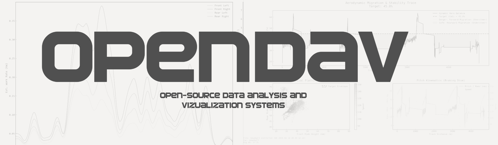
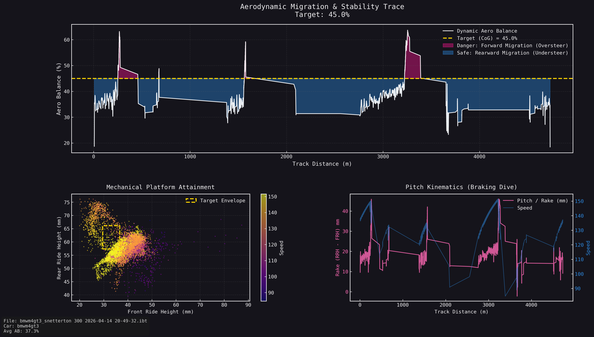
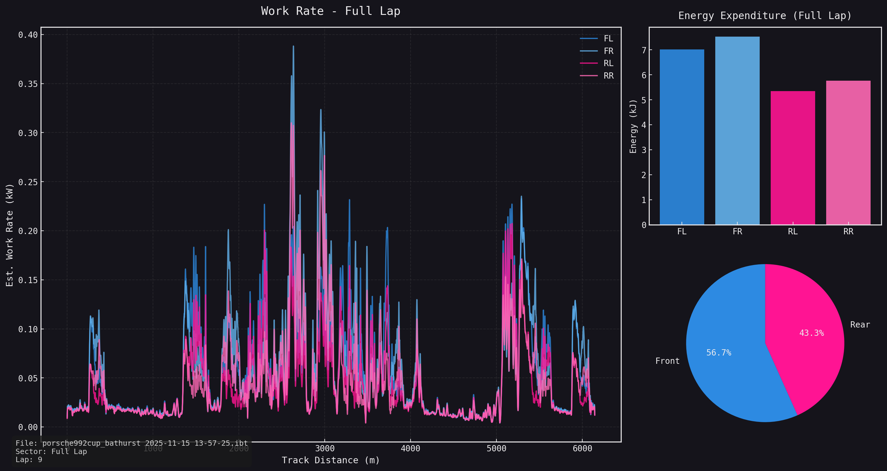
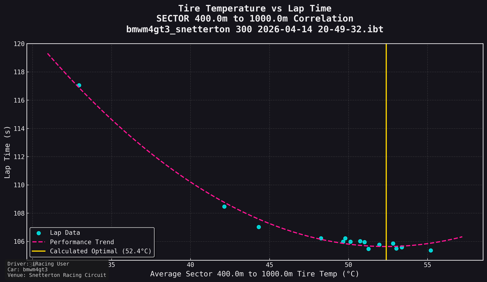

<div align="center">
  
</div>

# OpenDAV
**Open-Source Data Analysis & Virtualization**

OpenDAV is a highly specialized, terminal-based telemetry analysis and race engineering suite designed for professional sim racing applications. Born from the need to move beyond standard line graphs, OpenDAV processes raw binary telemetry (`.ibt`, `.ld`) to generate empirical, mathematical models of vehicle dynamics. 

It is designed to bridge the gap between raw data and actionable engineering decisions.

---

## Core Philosophy

Traditional telemetry suites (like MoTeC or ATLAS) focus heavily on displaying raw time-series data. OpenDAV assumes the role of a data scientist, transforming that raw data into comprehensive mathematical models. Rather than asking the engineer to interpret 10 different suspension traces, OpenDAV computes the exact Aerodynamic Downforce, Pitch Kinematics, and Tire Energy Bias, outputting the result as clear, actionable 3D and 2D topography maps.

## Features

### Empirical Aero Mapping
OpenDAV automatically identifies high-speed stable corners and zero-G coast-down zones to mathematically isolate aerodynamic load from mechanical weight transfer. 
*   Generates **3D Topography Surfaces** plotting Downforce vs. Front/Rear Ride Height.
*   Calculates dynamic **Aero Balance (AB %)** migration across a lap.
*   **Target Delta Analyzer (L3):** Highlights dangerous forward aero-migration (oversteer) against the vehicle's Center of Gravity.

<div align="center">
  
  <br><em>Fig 1: Empirical aerodynamic topography shift between two setup iterations.</em>
</div>

### Tire Energy Profiling
Translates traditional surface temperature data into physical work (Joules/Watts). 
*   Identifies exactly which tire is doing the most work across a stint.
*   **Sector & Corner Analysis:** Breaks down tire energy expenditure corner-by-corner, isolating lateral vs. longitudinal slip bias.

<div align="center">
  
  <br><em>Fig 2: 2D Tire Energy & Temperature distribution map.</em>
</div>

### SimGit (Project Workspace Engine)
OpenDAV features a built-in version control system for race engineering.
*   **Setup Tracking:** Link specific telemetry files to specific vehicle setups.
*   **Vehicle Model Editor:** Fuses raw telemetry with exact physical constants (Spring Rates in N/mm, Motion Ratios).
*   **Automated Workbooks:** Batch-process an entire stint of telemetry through multiple analysis modules simultaneously.

<div align="center">
  
  <br><em>Fig 3: Granular sector-by-sector load distribution.</em>
</div>

### Proprietary Setup Parsing
OpenDAV includes a custom, standalone C# decryption engine capable of parsing proprietary iRacing `.sto` binaries offline. It bypasses internal AES-256-CBC encryption to extract the raw C++ physics struct, automatically feeding exact spring rates and vehicle constraints directly into the SimGit Aero model.

---

## Technical Architecture
*   **Core:** Python 3.10+
*   **GUI / TUI:** Prompt-Toolkit (Terminal)
*   **Math Engine:** NumPy, SciPy (RBF Interpolation, Convex Hulls, cKDTrees)
*   **Rendering:** Matplotlib (with custom Matplotx Aura Dark styling), Plotly
*   **Crypto Engine:** C# / .NET 8.0 (Offline STO parser)

## Installation & Usage

1. Clone the repository to your local machine.
2. Install the required dependencies:
   ```bash
   pip install -r requirements.txt
   ```
3. Run the main application:
   ```bash
   python opendav.py
   ```

*Note: OpenDAV requires properly logged suspension load channels (or shock deflection with configured spring rates) to calculate empirical aero maps.*